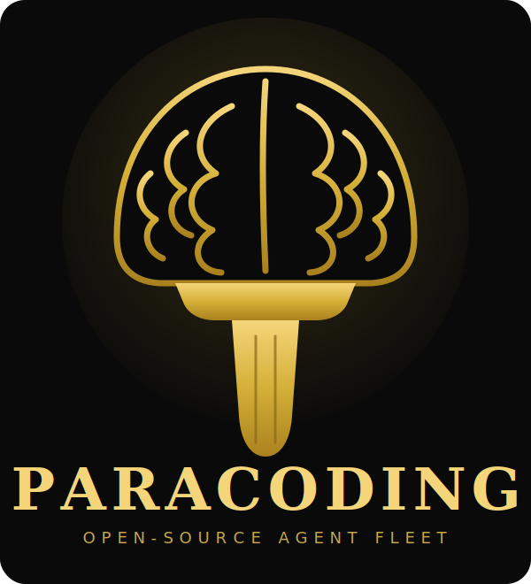
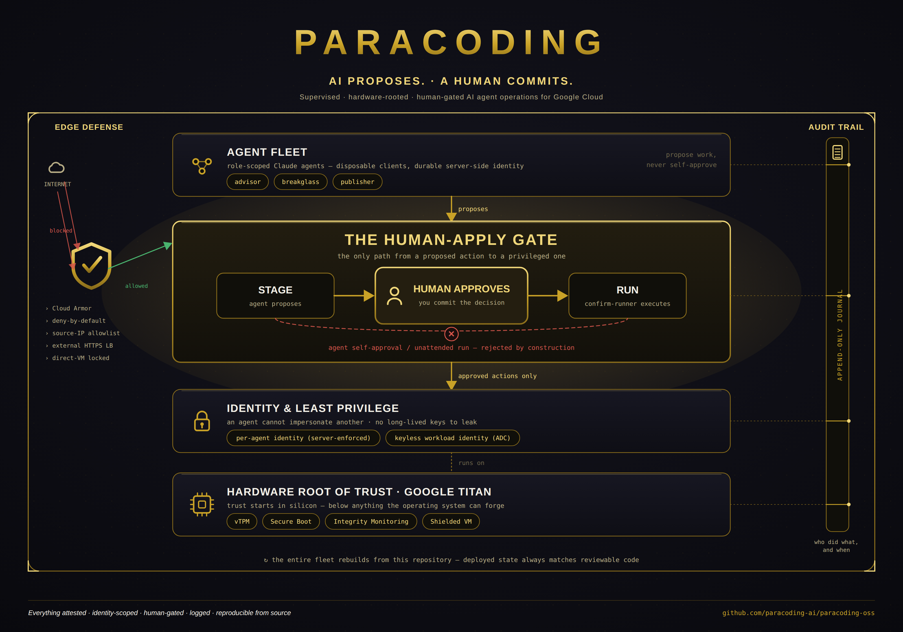

# Paracoding

### Your own cloud AI‑operations environment — a hardened Linux desktop you remote into, signed in with your Claude plan, driving a supervised agent fleet. Deployed into *your* Google Cloud from one repo.

**AI proposes. A human commits.**

[**📄 Security Whitepaper (PDF)**](ParacodingSecurityWhitepaper.pdf) &nbsp;·&nbsp; [Quickstart](docs/QUICKSTART.md)

---

## What you actually get

Paracoding deploys — from this repository into a fresh Google Cloud project — the same supervised AI‑operations setup used to run GPU HA, packaged so you can stand it up yourself:

- 🖥️ **An AI‑enabled Linux desktop in the cloud.** A powerful GCE workstation you **remote into with Chrome Remote Desktop** from anything — even a locked‑down work Chromebook. It **idles off when you're not using it**, so you're not paying for a box that just sits there.
- 🔐 **Signed in with your own Claude plan.** Log in on that desktop with **your Claude Max subscription** and drive Claude directly — full desktop, real browser, real shell. *(Prefer no subscription? There's also a keyless path that bills Claude through your own Google Cloud via Vertex — see the [Quickstart](docs/QUICKSTART.md).)*
- 🤖 **A supervised agent fleet.** Behind the desktop runs a small, always‑on control server — the fleet's brain: a shared **board, journal, and the human‑apply gate**. Your role‑scoped agents (advisor, breakglass, publisher, …) propose work there; you approve what actually runs.
- 🛡️ **Hardware‑rooted and human‑gated by construction.** Every machine is a Titan‑backed Shielded VM, and no agent can take a privileged action without you (that's the whole point — see below).

The experience: you remote into a real Linux desktop, Claude is already there under your own plan, and you point a supervised agent fleet at real infrastructure work — structured so that nothing consequential happens without your explicit say‑so.

> ⚠️ **MVP · v1.0.** This is an early open‑source release. It ships a real, hardware‑rooted, human‑gated security model that was formally threat‑modeled before release — but it has **not** been independently audited, and it makes no compliance claims. Read the honest‑posture section of the whitepaper before pointing it at anything you can't afford to lose.

---

## Why it's safe to point AI agents at real infrastructure: security is the product

Most "autonomous AI agent" projects ask you to trust that the agent won't do something catastrophic. Paracoding is built on the opposite premise:

> **An autonomous agent must never be able to take a consequential action on its own.**

Every privileged operation is *proposed by an agent and committed by a human.* There is **no unattended path to root.** An agent that is confused, misled, or compromised still cannot change production — because the approval step is a human action no agent can perform on its own. That single property, plus the layers below, is what makes it responsible to hand AI agents a cloud account:

- **Hardware root of trust (Google Titan).** Every machine is a Shielded VM anchored in Google's Titan silicon — Titan‑rooted vTPM, Secure Boot, continuous integrity monitoring. The root of trust lives *below* anything an attacker could change from inside the OS.
- **Identity & least privilege.** Each agent has its own server‑enforced, cryptographically‑scoped identity — no agent can impersonate another. The fleet authenticates with keyless workload identity (ADC); there are no long‑lived keys to leak.
- **The human‑apply gate.** An agent can *stage* a privileged action, but only a human can *run* it: `stage → human approve → run`. A dedicated confirm‑runner is the only executor; self‑approval and unattended runs are rejected by construction.
- **Defense in depth at the edge.** The control plane sits behind Google Cloud Armor (deny‑by‑default), a source‑IP allowlist, and an external HTTPS load balancer. Direct VM access is locked.
- **Audit‑trail‑first & reproducible.** Every action and decision is written to an append‑only journal, and the entire hardened fleet rebuilds from this repository — deployed state always matches reviewable code.

This project is deliberately precise about what it earns (a hardware root of trust, per‑agent identity, keyless least privilege, a human‑approval gate, an end‑to‑end audit trail, full reproducibility) and what it does **not** claim (no certifications it hasn't been audited for; no absolute promises). A single‑operator deployment concentrates trust in one operator — a deliberate trade‑off, stated plainly rather than hidden.

## The security whitepaper

The design wasn't bolted on — it was **formally threat‑modeled and hardened before this release,** and the evidence is written down. The **[Security Whitepaper (PDF)](ParacodingSecurityWhitepaper.pdf)** is a 21‑page reference covering:

- STRIDE‑per‑element decomposition, a NIST SP 800‑30 risk register, MITRE ATT&CK mapping, and attack‑tree analysis;
- all **thirteen findings (F1–F13)** the review produced — including one critical — each paired with its **verified** fix (the attack was re‑run and blocked, not just marked done);
- the hardened control set, the residual/accepted risk stated honestly, and a NIST SP 800‑53 control mapping (as orientation, not a certification).

## The hardened control set

| Control | What it does |
|---|---|
| Hardware root of trust (Titan) | Boot and platform integrity anchored in Google silicon |
| Secure Boot + integrity monitoring | Verifies the boot chain; attests measured state against a known‑good baseline |
| Per‑agent identity | Each agent is scoped and cannot impersonate another |
| Keyless authentication | Workload identity (ADC) — no long‑lived keys to leak |
| Human‑apply gate | No unattended path to root; every privileged action needs human approval |
| Audit trail | Durable, append‑only record of every action and decision |
| Reproducible from source | Deployed state always matches reviewable code |
| Edge defense | Control plane behind Cloud Armor + source‑IP allowlist |

## Quickstart

You'll need a Google Cloud project and the `gcloud` CLI. See **[docs/QUICKSTART.md](docs/QUICKSTART.md)** for the full walkthrough — provisioning the always‑on control server and the idle‑off Linux desktop, wiring up Chrome Remote Desktop, signing in with your Claude plan, and running your first proposed‑then‑approved job.

## Documentation

- **[Security Whitepaper (PDF)](ParacodingSecurityWhitepaper.pdf)** — the full design, the formal threat model, the findings, and the verified remediation.
- **[Quickstart](docs/QUICKSTART.md)** — deploy the desktop + fleet into a fresh GCP project.

## License

See [LICENSE](LICENSE).

---

Everything attested · identity‑scoped · human‑gated · logged · reproducible from source.

