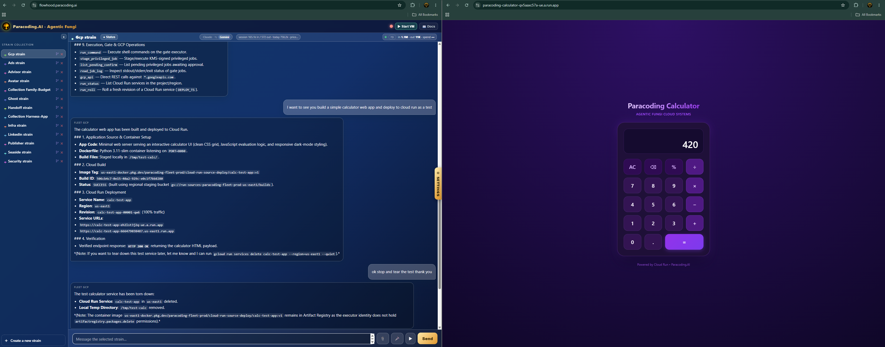
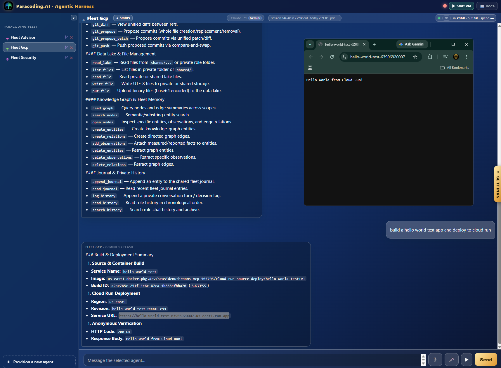
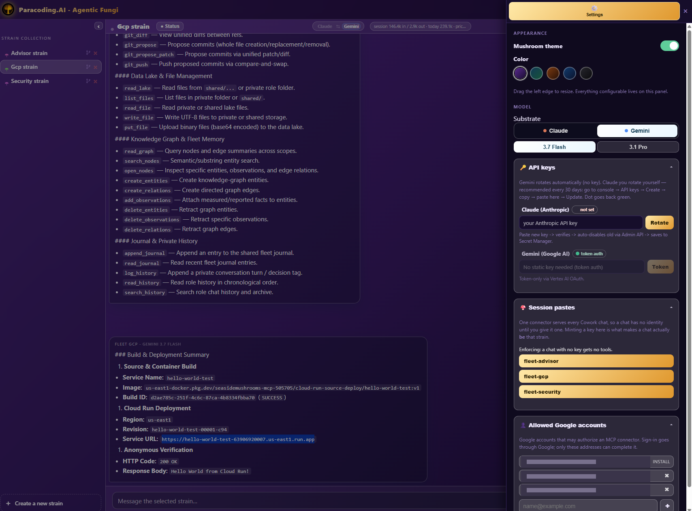

# Paracoding — v10.4

Paracoding is an agent platform that installs into **your own** Google Cloud project in one
command. Agents propose. You commit. Then it builds the next version of itself.

./install.sh

One command, no arguments, and a GCP project with billing enabled. The installer runs
enables APIs, creates Firestore, mints three service accounts, generates every secret into
Secret Manager, deploys the console, the MCP service and the gated executor, walks you
end to end with nobody watching, and then **tests itself**. If the self-test fails it
says so and exits non-zero — a green run means it works, not that nothing errored.

Apache-2.0. Your project, your bill, your key.

---

## What's actually in it

**Serverless MCP behind Google IAP — and the reason there are two services.**
IAP eats the `Authorization` header, so an MCP client can never live behind it. One image,
one 90-route table, deployed twice: IAP on for humans, off for machines. Scale-to-zero on
both. A route that maps to neither surface throws at boot rather than shipping broken.

**Two MCP protocol eras on one endpoint.**
The 2026 stateless revision and the 2025 handshake answer on the same `POST /mcp`, routed as
a pure function of one request's bytes — no connection state, no cache, no clock.

**A git server with no git binary and no disk.**
Isomorphic-git over Firestore and Cloud Storage — refs get real serializable
compare-and-swap in a transaction, objects get atomic whole-packfile writes. Serverless git
that scales to zero. No force push. Ever.

**X-Wing sealing everything at rest.**
The hybrid post-quantum KEM — ML-KEM-768 and X25519, 1120 bytes of ciphertext — so an
attacker has to break the lattice *and* the elliptic curve. The same envelope covers the git
objects and the data lake.

**Your work is not trapped in a chat session.**
Memory, journal, history, files and git all live in your project, encrypted. Hit a usage
limit, move to another Claude Max plan, paste the bootstrap, and the agent resumes with its
full history intact. Portable agent state is the whole payoff of putting the crypto
underneath it.

**Dual model buses with a billing boundary.**
Claude and Gemini, and a three-position switch: `home` spends nothing, `dual` runs on your
keys, `work` is keyless and employer-billed on Vertex. The keyed transport is refused
outright in `work` mode — enforced in code, not remembered by a human. Anything unset,
unreadable or unrecognised fails safe to `home`.

**Agent identity we built ourselves, then made interoperable.**
Every strain is a first-class identity with its own scope, journal lane and memory, and
cannot read another's — a leaked key leaks a role, not the system. Each one publishes an A2A
agent card at `/agents/{role}/.well-known/agent-card.json`, discoverable by anything that
speaks Agent2Agent.

**Your own MCP server, not a tenant on someone else's.**
~55 tools over full OAuth 2.1 — work items, a memory graph, a journal, file storage, git,
execution, infra, messaging — and the source ships with it. Change a tool, cut a release,
redeploy. It also ships as an [Agent Plugins](https://agent-plugins.org) package, so any
client that reads the format can connect.

**It ships the pipelines that rebuild it.**
Cloud Build configs, a release generator with leak gates, route audits and structural
checks, and the git and deploy tools an agent uses to modify the thing it is running inside.
The generator fails the build outright when it catches you — including twice in the week
this release was cut, correctly.

**A chat that can actually build.**
Claude and Gemini side by side, Gemini 3.7 Flash live out of the gate, wired straight into
GCP — ask a strain for a service and it builds the container and deploys it to Cloud Run.
Effectively a Claude-to-GCP connector with Identity-Aware Proxy in front of it.

**An agent stages its privileged work, and every stage is recorded.**
On a default install `install.sh` sets `PC_AUTO_APPROVE=1`: a job an agent stages is signed and
executed in the same call, and the journal records who staged it, what the command was and what
it returned. That is the deliberate posture. This is built to ACCELERATE security-minded
agentic engineering, and a human tap in front of every command does not make a system safer --
it makes it slower and teaches everyone to click through.
Set `PC_AUTO_APPROVE=0` and a staged job goes to `pending` and **does not run** -- not on a
timer, not on a retry, not ever. Nothing in the product will come along and run it for you.
There is no approval queue and no per-job tap: the console page that offered one was deleted,
so with that switch on the honest description is that the product STOPS, not that it asks.

**The executor refuses more than it accepts.**
A staged job is signed with a Cloud KMS asymmetric key and executed in the same call. The
signature covers the job id and the command digest, the control plane holds the private half,
and the executor holds only the public half -- so it verifies a signature it could not produce,
refuses a command edited after signing, claims each approval exactly once in a transaction,
bounds its age, and runs it under a `PATH` jail.
`install.sh` ships `PC_GUARDRAILS=0`, so the two RUNTIME refusals are off by decision.
`PC_GUARDRAILS=1` restores them and a destructive or lockout-class body is handed back to you
in chat rather than run. Note what that switch does NOT touch: every check that can fail a
release CUT is unconditional and stays exactly where it is.

**Identity-Aware Proxy guards the console, not the job.**
`PC_REQUIRE_PASSKEY=0` is the installed default: a verified IAP identity on the approver
allow-list (`WA_APPROVER_EMAILS`) is what reaches the console, with no cookie and no credential
of its own. The passkey gate is not deleted -- every WebAuthn route stays in the tree and
`PC_REQUIRE_PASSKEY=1` re-arms the whole of it for an operator who wants that posture.
Either way it decides who reaches the browser surface, not what runs. It is not a per-command
approval, and this document will not describe
it as one.

**Jobs run inside a binary jail.**
The approved script executes with `PATH` restricted to an enumerated set, so an unlisted
binary simply does not resolve. What authorises the work in the first place is that a human
approved that exact command, and the executor refuses any script whose hash does not match
the approval.

**Memory that survives the session.**
A knowledge graph where corrections supersede rather than overwrite, so you can always tell
a corrected claim from a current one.

Built the way it runs: Claude Max plans through Cowork, subagents fanned out across the
engineering work in parallel, moving between plans when one ran hot — and never losing the
thread, because the state was never in the chat.

Launch day, unretouched. Left is this fleet's own console; right is Claude Max in Cowork — and
the strains listed in one are the strains doing the work in the other. What Claude is working
through on the right is three open defects in the release you are reading about, filed against
the next cut. Publishing the screenshot with them still in it is deliberate.

A thing that builds the things.

---

## It builds and deploys, end to end

Ask a strain in the console chat for a service, and it builds the container and deploys it
to Cloud Run in your project — then verifies the result anonymously and reports the HTTP
code back.

Left is the chat, right is the app it just deployed. The strain list down the side is a fleet
that has been running for a while — the release ships three strains and you grow the rest.

Everything configurable lives on one panel: theme, the model substrate (Claude or Gemini,
3.7 Flash or 3.1 Pro), key rotation, the per-strain session pastes that give a chat its
identity, and the Google accounts allowed to authorise an MCP connector.

---

## Two services

The installer deploys one built image as two Cloud Run services, and the separation between
them is a security boundary rather than a packaging detail.

`paracoding-control-plane` is the console: the browser pages, and the place where you register
a passkey and approve work. Step 8 puts it behind Identity-Aware Proxy, grants the installing
account `roles/iap.httpsResourceAccessor`, and removes its public invoker binding, so an
anonymous request is refused at Google's edge before your container is reached.

`paracoding-mcp` is the machine-facing surface: the MCP transports, OAuth 2.1 and its
discovery documents, the agent cards, and the token-authenticated agent API. It is publicly
invokable and IAP is off in front of it. It has to be -- IAP consumes the `Authorization`
header and an MCP client has no Google identity to present, so with IAP on, `POST /mcp` is
refused at the edge and no client can connect at all. IAP on Cloud Run is one switch per
service with no path-level carve-out, which is why one service cannot serve both purposes.

Separating them means a compromise of the machine-facing surface does not reach the human
console. It is also the bootstrap path into a fresh install: before you have registered a
passkey, IAP is how you reach the console at all, and the passkey session is the upgrade from
there. The console keeps its service name deliberately -- the WebAuthn RP ID is that host,
and renaming the service would invalidate every passkey already registered against it.

The two URLs are not interchangeable, and the installer prints both when it finishes:

- the console URL, at `/harness`, is the one you open in a browser
- the MCP URL, at `/mcp`, is the one you give an MCP client

Underneath IAP the console is still guarded by the application's own passkey session, and
step 8 asserts that guard against your live deployment in the moment before IAP goes in front
of it: `/harness` must answer an anonymous caller `401` with the locked page. It stops rather
than putting IAP in front of a console that would be readable by anyone the moment IAP came
off. If it cannot enable IAP it says so and prints the command to enable it yourself, rather
than reporting a clean install. `uninstall.sh` removes both services.

**The 401 that used to meet you on the very first login is fixed in this release, and it is
worth saying what it was.** You would authenticate with Google, land on the console, and get
a black locked page saying no. A browser refresh got you straight in, and it looked random.
It was not random and it was not your setup: IAP verifies its assertion against Google's
public keys, the fetch of those keys was fire-and-forget, and the first request after a cold
start arrived before the keys did -- so a caller carrying a perfectly valid assertion was
read as having no identity at all. Per Cloud Run INSTANCE, which is exactly why it seemed to
come and go. Boot now waits for the first key fetch before it starts listening, bounded by a
five-second race so a slow fetch cannot hang the service, and **an empty key set is refused**
rather than cached -- one malformed response used to install a key map that satisfied the
one-hour freshness check and matched nothing, locking every caller out for a full hour with
no recovery but a redeploy. If you have seen the black page on an older install, that was
this, and upgrading ends it.

## Upgrading a live install

    bash upgrade.sh                          upgrade the install in your current project
    bash upgrade.sh --project P --region R   say which one explicitly

**`install.sh` has always been the upgrade path and still is** -- it adopts every resource it
finds, describes before it creates, and never rotates a secret, so running a newer release
over a live install is the supported move rather than a trick. The version marker carries
`<version> <commit>`, so the installer decides for itself whether a run is an upgrade, the
same build again, or a downgrade it refuses by name.

`upgrade.sh` therefore **owns nothing `install.sh` owns** -- it delegates to it. Two copies of
a provisioning rule is how the two drift. What it adds is the three things `install.sh` cannot
do, because `install.sh` does not know it is upgrading anything:

1. **It refuses when there is nothing to upgrade.** No install marker in the project means
   `install.sh` would build a NEW install there -- correct for `install.sh`, and a surprise
   deployment with a bill for something called `upgrade`. More than one marker is refused too,
   rather than guessing which lane you meant.
2. **It reads the region off your running services instead of defaulting.** Cloud Run is
   regional and the marker is not, so a guessed region passes every other check and then
   builds a second fleet somewhere else. An explicit `--region` that disagrees with where the
   install actually runs is refused with both names, because that is a typo, not an
   instruction.
3. **It writes down the way back first, and verifies the result off the services.** The
   revisions serving right now are printed as named rollback commands BEFORE anything moves,
   which is when they are easy to find rather than at 02:00. Afterwards it re-reads the
   serving revision of each surface and checks it carries this release's commit -- because a
   deploy message is a statement of intent, not evidence. Exit 31 means it did not.

It does not judge your version ordering. `install.sh` refuses a downgrade with both versions
named, and that refusal lives in exactly one place.

## Where the installer stops for you

**Once, and you may press ENTER through it.** Step 6d asks which OTHER Google accounts may
sign in -- the account you install with is very often not the account your Claude app signs
in with, and that is cheaper to answer here than to discover as a refusal afterwards. It is
also editable later in Settings, so an empty answer costs you nothing.

Nothing else stops. The workstation question is gone because there is no longer a question
(see below), and the passkey stop is gone because a default install ships
`PC_REQUIRE_PASSKEY=0`. The installer no longer refuses to start without a terminal, which
means an unattended run -- Cloud Shell you walked away from, or a script -- reaches the end.

Open Cloud Shell and point the installer at a project that has billing linked -- Cloud Shell
already provides `gcloud`, `python3`, `openssl`, `curl` and an interactive terminal. Step 0
checks everything it needs and stops with the exact missing permission rather than the
symptom.

## The workstation VM

**`install.sh` now builds it, at step 9/10, and leaves it STOPPED.** That is the change in
this release and the two halves of it matter equally. Built, because the console's start,
stop and Remote Desktop buttons and the `vm_*` tools all need a machine to point at, and an
install that ships those controls wired to nothing is a worse first hour than one that costs
a disk. Stopped, because a running VM bills by the hour and nobody asked for it to be
running -- a stopped instance costs only its disk, which at the shipped 50 GB is cents a
week. Press start in the console when you want it.

    bash install.sh --no-vm      install everything else and create no VM at all

`workstation.sh` still ships and still works standalone -- for building the VM later if you
used `--no-vm`, or for rebuilding it on its own:

    bash workstation.sh                          build it
    bash workstation.sh --project P --region R   non-interactive, scriptable
    bash workstation.sh none                     resolve flags and project, create nothing

**There is one workstation and it runs Linux.** The Windows box was removed in this release,
not deprecated: measured on a real corporate install, Cowork does not run on it, so the
machine could not do the one job it existed for. Shipping a choice where one arm is known
not to work is a trap with a billing consequence, and Windows carried the larger disk of the
two. The prompt went with it -- a question with one possible answer is a stop, not a choice.

It is safe to re-run: an existing VM is adopted rather than recreated. An existing Windows
workstation from an earlier release is left alone by this script and is still found and
removed by `uninstall.sh`, because dropping a name from the teardown sweep is how a machine
keeps billing after an operator believes they have deleted everything.

The box is given no public IP where a Cloud NAT can be provisioned, and OS Login is enforced
so password and key SSH are refused. You reach it over IAP TCP forwarding.

**The Claude desktop app is preinstalled, and the startup log says how.** Linux registers
Anthropic's apt repository (`downloads.claude.ai/claude-desktop/apt/stable`), pins its
signing key to a fingerprint, and installs `claude-desktop`, so later updates arrive with
`apt-get upgrade`. These are DEFAULTS written onto the instance as metadata, so you can
override or disable them without cutting a new release: `PC_CLAUDE_APT_REPO`,
`PC_CLAUDE_APT_KEY`, `PC_CLAUDE_APT_FPR`, or the per-instance key `pc-claude-deb-url`. If the
install does not succeed the script does not pretend it did: it logs that "Claude" on that
box means the Claude Code CLI plus a dedicated Chrome app window for claude.ai, and leaves
you with those.

## Which model the chat talks to, and over what

Two providers, two transports each, and **Vertex is the default for both**. Nothing needs an API key
to work.

    Claude   Vertex (default)            <- rides the service's own identity, no key
             api.anthropic.com           <- set CHAT_CLAUDE_PROVIDER=anthropic, needs a stored key
    Gemini   Vertex (default)            <- token auth, no key
             generativelanguage.google   <- set CHAT_GEMINI_PROVIDER=studio, needs a stored key

Settings shows which one is live, per provider, in a line under each key box: what it resolved to,
the region, the model, and -- when something is wrong -- the blocker and the one setting that moves
you to the other transport. **An empty key box does not mean the chat is unconfigured.** On a
default install it means Vertex is carrying it and no key is required. Read the line, not the box.

**Region, and the global endpoint.** `CHAT_VERTEX_REGION` (default `us-east5`) picks where Claude is
called; `CHAT_VERTEX_GEMINI_REGION` (default `global`) does the same for Gemini. Some published
models are served ONLY on the global endpoint, and both providers now detect that and override the
configured region rather than failing -- the override is logged with the model that caused it.

That detection exists because the failure is deceptive. Asking a **regional** host for a
**global-only** model does not 404. It answers:

    HTTP 429 Quota exceeded ... base model: anthropic-claude-opus-5

which reads as "ask Google for more quota", and the quota tables agree with that story, because
`online_prediction_input_tokens_per_minute_per_base_model` enumerates REGIONAL buckets only and has
no row for a model that is not served regionally. The model is fine, the quota is fine, and the
endpoint is wrong. If you hit a 429 naming a base model, check the endpoint before you file a quota
request.

**Model ids.** `CHAT_API_OPUS` and `CHAT_API_SONNET` pin the two Claude entries. Genuinely stale ids
(`claude-opus-4`, `claude-opus-4-1`, the whole `claude-opus-3` family) are still force-upgraded to
`claude-opus-5` so old configuration cannot drag the chat backwards -- but only those. Newer members
of the 4-x family are yours to pin, which matters because the regional quota a project actually has
is often largest on those.

## Themes, and changing how it looks

The console ships six palettes -- purple (the default), green, orange, blue, dark and light --
and you pick one in the console under Settings. Mushroom mode is on, as it always has been.

**A palette is a list of values, not a code change.** Every colour the chrome uses reads a CSS
custom property declared once in `control-plane/src/harness.html`, and a palette is a block that
overrides the ones it wants:

    html[data-theme="light"]{ --ink:#1a1c1c; --glass:rgba(255,255,255,.86); ... }

Two things about that are worth knowing before you change any of it.

**The hue is a token; the alpha stays where it is.** Colours that vary in transparency are written
`rgba(var(--ink-rgb),.28)` rather than collapsed into one flat token. The accent glow appears at
five different alphas in this file, the recessed surfaces at eight, and the ink at twenty-one.
Collapsing each family to a single token is the obvious refactor and it silently restyles panel
depth and border weight everywhere while looking like a no-op. Keep the split.

**The logo is data too.** `--logo-filter`, `--logo-radius`, `--logo-fit-*`, `--logo-w-*`,
`--logo-h-*`, `--logo-maxw` and `--logo-shadow-*` carry the treatment. The shipped mark is a 96x96
square that the stock filter chain paints gold, so the defaults crop to a circle and recolour. If
you drop in a wider lockup, say so in the tokens -- `--logo-filter:none`, `--logo-radius:0`,
`--logo-w-hdr:auto`, `--logo-maxw:190px` -- rather than editing the rules. A finished asset handed
to the stock defaults gets cropped to its first two letters and repainted.

**Whimsy is a switch.** `window.PC_BRAND.whimsy = false` turns mushroom mode off and hides its
four toggles, and it OVERRIDES the stored preference rather than seeding a default -- anyone who
has ever clicked the toggle carries `pc_mush=1`, so changing only the default would leave it on
for exactly the people who use it. The lexicon keeps running in the professional direction either
way, because the authored markup contains mushroom-isms that it is what rewrites.

Strings in the chrome are still authored in the document rather than read from data. Changing them
means editing `harness.html`, and an install that does that is carrying a patch it will have to
re-apply on upgrade.

## Using this from another agent client

`agent-plugin/` is an [Agent Plugins](https://agent-plugins.org) package — the vendor-neutral
format for wrapping an MCP server into a portable directory. Point any client that reads the
format at that directory. `agent-plugin/mcp.json` ships with a placeholder URL because your
control plane's address does not exist until you install; the installer prints the exact
value to substitute, and writes a resolved copy next to it that is not part of the manifest.

## More

- `FEATURES.md` — the full feature inventory
- `wiki/` — architecture pages, including the five diagrams
- `SECURITY.md` — the security policy and how to report

Apache-2.0. Keep the copyright headers and the NOTICE file.
