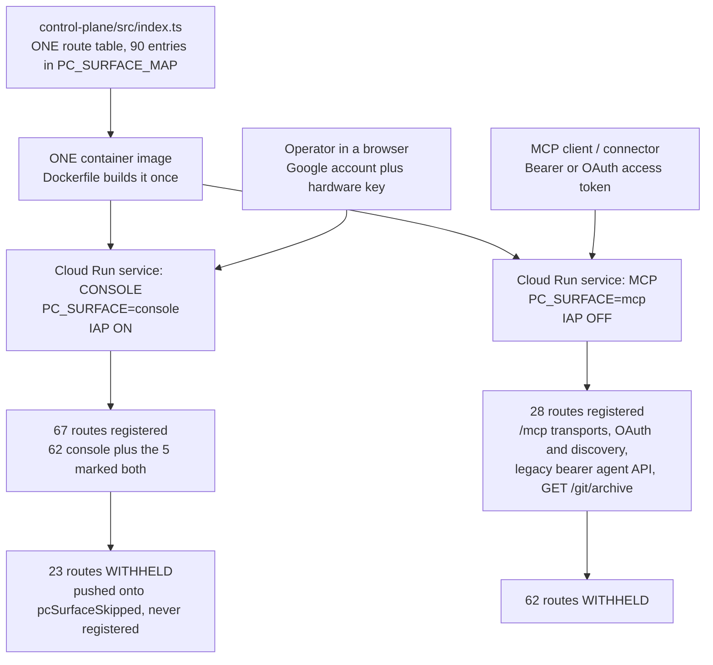
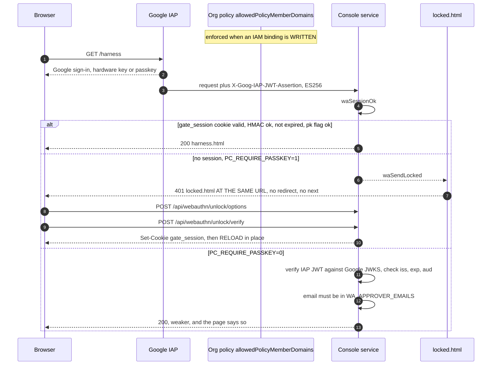
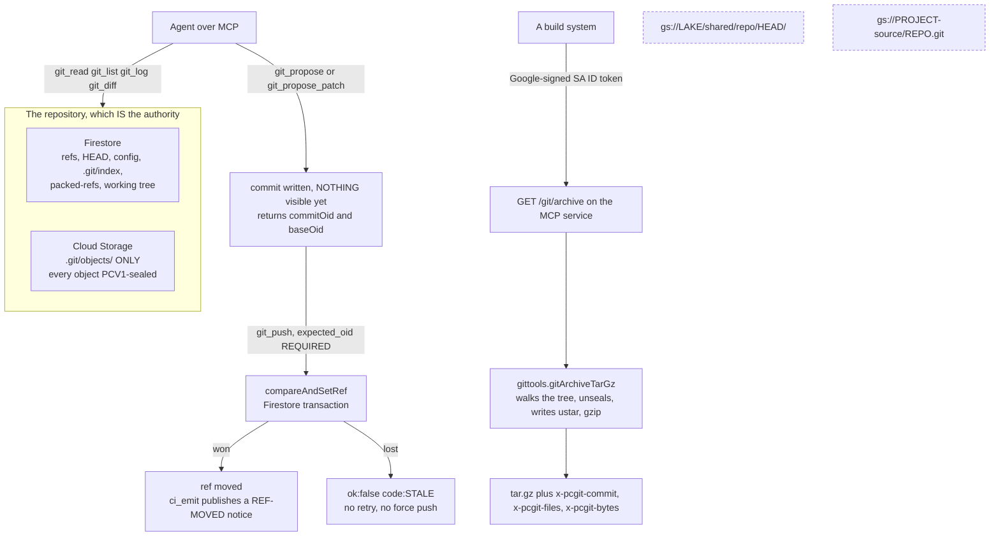
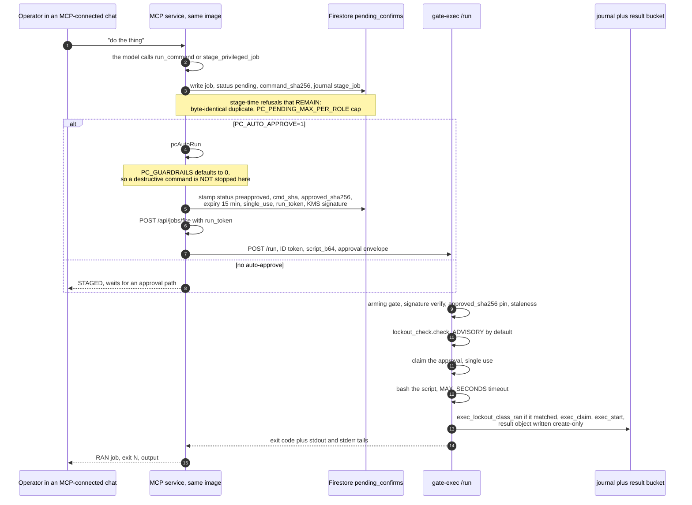
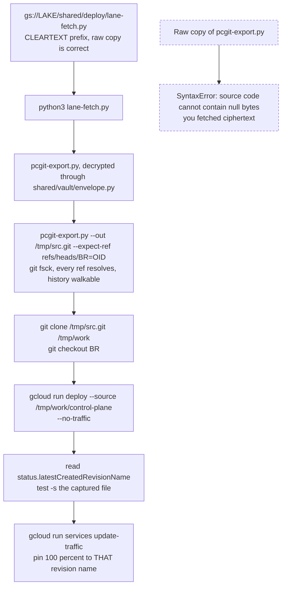

# Architecture, and a walk through the code that implements it

This page is the map. It answers "what talks to what, and where does that live in the
tree" for the five things an operator or an adopter actually has to reason about: the two
services built from one image, the auth path into the console, the git store, a job from
chat to journal, and the deploy. Every diagram is followed by prose, because a diagram
shows the boxes and hides everything that matters -- the refusals, the ordering, the
things that fail closed and the things that fail open on purpose.

**What is measured here and what is not.** Line numbers, symbol names, defaults, counts and
file sizes on this page were read out of the files in this repository at the time it was
written. Where a number came from a document rather than from the code, the document is
named. Where something is a design intention that this page cannot prove from the tree, it
says so in the sentence rather than in a footnote. Code moves; if a line number here does
not land where you expect, trust the symbol name and grep for it.

**About the diagrams.** Each section carries a rendered picture followed by its Mermaid
source. The picture is generated FROM that source and served from the container image at
`/wiki/assets/`, so it cannot drift from the block beneath it and an install fetches nothing
from anywhere else. The source is kept visible rather than replaced because it is the thing
that is diffable, reviewable and editable; the picture is a convenience laid on top of it.
Measured, so you are not surprised: `oss/wiki/_shell.html`'s `render()` matches a fence with
`/^\s*```(.*)$/`, **discards the info string**, and emits `<pre><code>` with the body
escaped. On this wiki, in this shell, those blocks therefore render as monospaced text
rather than as pictures -- which is exactly why the rendered images were added beside them.

---

## 1. One image, two services




**Why there cannot be one service.** IAP on Cloud Run is one switch per service. The
console is the bootstrap path into a brand-new install, so it must sit behind IAP -- that
is how the operator reaches a working page before any passkey exists. The MCP surface must
*not* sit behind IAP, because IAP consumes the `Authorization` header and an MCP client has
no Google identity to present. Both of the obvious builds were tried and both are recorded
in the source comment at `index.ts` around line 393: one service with IAP on made `/mcp`
unreachable, and turning IAP off destroyed the bootstrap path. Deploying the same image
twice with a different `PC_SURFACE` is the third option.

**What `PC_SURFACE_MAP` does, and when.** It is a plain object literal, keys of the form
`METHOD` + one space + the path string exactly as registered, values `console`, `mcp` or
`both`. `PC_SURFACE` is read once at module scope (`index.ts:430`). If it is unset, nothing
below it runs at all: no wrapper is installed, no lookup happens, and every route registers
exactly as it always did -- which is why landing the split could not brick a single-service
install. If it is set to anything other than `console` or `mcp`, the module throws at boot.

When it *is* set, the code wraps `app.get`, `app.post`, `app.put`, `app.patch`,
`app.delete`, `app.all`, `app.options` and `app.head`. Each wrapper builds the key, looks it
up, and:

- a key that is **absent from the table throws**, at boot, naming the key. A route that
  lands on neither service is a silently broken install, and that is the exact failure the
  table exists to make impossible;
- a value that is not this surface returns `app` without registering, and the key is pushed
  onto `pcSurfaceSkipped`;
- a match registers normally and is pushed onto `pcSurfaceKept`.

A `process.nextTick` then prints one line: how many routes this surface registered and how
many it withheld. Counted from the source today: **90 entries, 62 `console`, 23 `mcp`, 5
`both`.** So the console service registers 67 and withholds 23; the MCP service registers
28 and withholds 62. `control-plane/route-baseline.json`'s `surface_split` block records
the same 90/62/23/5 alongside 73 guarded and 17 public.

**What the diagram does not show.**

*Almost nothing is marked `both`, and the three that are tell you what `both` is for.* The
split was decided by the auth mechanism each handler actually uses. A handler that calls
`waSessionOk` or `waGate` is reachable only from a browser that has been through the
console's auth, so it is `console`. A handler that calls `assertIdentity` or `oaBearerRole`
is reachable only from a machine client, so it is `mcp`. Those two mechanisms partition
almost the whole table. The exceptions are `GET /oauth/authorize`,
`POST /oauth/authorize/complete` and `POST /oauth/authorize/key` -- the OAuth consent leg,
which is genuinely walked by both callers: a human in a browser approves it, and a machine
client is what asked -- plus `GET /favicon.ico` and `GET /icon.png`, which a browser and an
MCP client each fetch for themselves. A route with two real callers says so in one word rather than being
registered twice. (This page said "nothing is marked `both`" until 2026-08-16; it was true
when written and the three above were added after. The counts moved with them.)

*The wrapper is a wrapper for a reason that lives in another file.* `route-audit.mjs` runs
as a **build step before esbuild** and parses `index.ts` as source with a pattern anchored at
column zero. Indenting a registration inside an `if` would hide it from that audit, which is
how a route disappears without anyone noticing. So every registration stays unindented where
it is and the decision is taken *inside* `app.get`/`app.post` instead. The audit enforces
this directly: a registration not at column zero is `ROUTE AUDIT FAIL` and exit 1.

*Express's settings accessor is not a route.* `app.get('some setting')` -- one argument, no
handler -- is passed straight through. Without that check the split would have thrown on a
settings read.

*One placement quirk worth knowing before it confuses you.* `'GET /git/archive': 'mcp'` is
physically written among the keys under the `---- console: browser pages ----` comment.
The comment is a comment; the **value** is what the wrapper reads, and the value is `mcp`.
The archive is a machine endpoint and it registers on the MCP service.

*Withheld is not blocked.* A route on the other surface simply does not exist on this
service. An anonymous caller gets Express's 404, not a refusal, because there is nothing
there to refuse. One consequence is documented in the source: the harness `app.use` guard is
not wrapped by the registration filter, so it answers on the MCP surface too, and a request
sent to the **wrong host** for a console path produces a `403 forbidden: no console session`
rather than a 404. That message names both possibilities on purpose.

---

## 2. The auth path




**Three controls, in order, and each one does a different job.**

**IAP** is the outer door and it is the only one an anonymous caller ever meets on the
console service. It authenticates a Google account; the posture this fleet runs is an
account carrying a hardware key -- a Titan -- or a passkey. IAP hands the request on with an
ES256 assertion in `X-Goog-IAP-JWT-Assertion`.

**The org policy** `constraints/iam.allowedPolicyMemberDomains` is the third control and it
does not sit on the request path at all. It makes granting console access to an
out-of-domain account *impossible* rather than discouraged: the grant is refused at the
moment it is written. Measured: adding a consumer Gmail address returned
`FAILED_PRECONDITION`, "not in permitted organization".

**The caveat travels with that claim and must never be separated from it.** The constraint
is enforced when a binding is **written**, not retroactively. Disabling the policy, adding
the account and re-enabling the policy *does* work, and the exception it creates is
permanent -- the binding survives. So the recommendation for a second pair of hands is a
second **in-domain** account with its own key, never a personal address admitted through a
temporary hole.

**The passkey session** is the inner door, and it is where the code you can read lives.
`waSessionOk` (`index.ts:2783`) is synchronous and is called as the first statement of every
guarded handler:

- **Fail closed on a weak secret.** `WA_SESSION_SECRET` shorter than 16 characters means the
  gate never *issues* and never *verifies* a session. An empty-key HMAC is forgeable, so a
  missing secret must mean no valid sessions rather than any cookie passing.
- **The cookie is `payload.sig`**, an HMAC-SHA256 over a base64url payload holding the user,
  a `pk` flag and an expiry. The signature is compared, then the expiry.
- **A session minted while the passkey was off does not survive turning it back on.** With
  `PC_REQUIRE_PASSKEY=1` a payload whose `pk !== 1` is refused. Without that, disarming for
  ten minutes would hand out full-length sessions that outlive the policy that permitted
  them.
- **`PC_REQUIRE_PASSKEY` defaults to on** (`index.ts:2669`: anything other than the string
  `'0'` is on). With it explicitly off, a *verified* IAP identity on `WA_APPROVER_EMAILS` is
  accepted. Verified means: signature checked against Google's IAP JWKS at
  `https://www.gstatic.com/iap/verify/public_key-jwk`, `iss` equal to
  `https://cloud.google.com/iap`, `exp` in the future, and `aud` equal to `PC_IAP_AUD` when
  that is set. `X-Goog-Authenticated-User-Email` is **not** trusted on its own -- it is
  trivially forged by anyone who reaches the service directly if IAP is ever detached -- and
  a cold JWKS cache fails closed and schedules a refresh rather than admitting the caller.

**What the diagram does not show.**

*There is no `/gate` any more.* The route, `GET /jobs`, `GET /pastes`, the 142,608-byte
`control-plane/src/gate.html` and all ten redirects into it are deleted (commits `cac7ce92`,
`11e060d8`). Verified against a running build: `/gate`, `/jobs` and `/pastes` return 404.
Verified in this tree today: `src/gate.html` does not exist, and a grep for those three route
strings in `index.ts` returns zero matches. `GET /` is a 302 to `/harness` (`index.ts:4717`)
and that is the whole front door.

*The 401 is served in place, which is the design and not an accident.* `waSendLocked` sets
status 401, `Cache-Control: no-store, no-cache, must-revalidate`, and sends
`locked.html` at the URL the caller asked for. Three consequences, all deliberate:
`?next=` is deleted rather than reimplemented, because the caller's URL never changed and
the unlock lands them where they already were by reloading -- and the enumeration oracle
goes with it; the status *means* refused, where the old 302 was indistinguishable from a
page that had moved; and **no `WWW-Authenticate` header is sent**, so no browser credential
dialog appears.

*The unlock page is small and carries exactly four flows.* `locked.html` is the only
document any console URL serves to a caller with no session: unlock, first setup with the
bootstrap secret, add-a-device consuming an enrol token, and the status call that chooses
between them. It **consumes** an enrol token and never mints one -- minting
(`/api/webauthn/enroll/link`) stays behind a session check, because handing out an
enrolment link is a privileged act. Removing any of the four locks the operator out with no
way back except a manual bootstrap, which is why the file says so at the top.

*One endpoint answers without a passkey session, and it is smaller than it sounds.*
`GET /api/webauthn/status` is mapped `console`, so IAP has already admitted the caller
against an in-domain Google account -- it is not reachable anonymously from the internet.
It answers
`{registered, setupEnabled, sessionMin, iap}` without a **passkey session**, which is
unavoidable: the locked page must choose a flow before a session can exist. What it used to
disclose was a standing answer to "is the first-registration window open", for the whole life
of the install. Since [SEC-STATUS-SETUPFLAG-V83] `setupEnabled` is reported **only while no
credential is registered** -- the one state in which the page reads it, since its branch sits
after `else if (st.registered)` -- so on any install with a passkey the field is constant
false. Note also what it never was: both setup endpoints refuse without a constant-time
`waEq()` match on `WA_BOOTSTRAP_SECRET`, so knowing the window is open was never sufficient
to walk through it.

*A session is not an approval.* `WA_SESSION_MIN` has an in-code default of 10 minutes;
`oss/wiki/pages/operators-guide.md` records that a fresh install sets 240, i.e. one unlock
opens the console for four hours. Elevation is separate and narrower: `waMakeElevated` binds
an elevation to **one job id and one command digest**, `WA_ELEVATE_MIN` defaults to 5
minutes, and `waElevatedForJob` re-hashes the command from the job's *current* arguments so
an edited command is refused. A generic "the human did a Face ID recently" cookie has never
been allowed to satisfy a destructive approval, and that is unchanged by anything below.

---

## 3. The git store




**Where the bytes live, and why they live in two places.** Refs, `HEAD`, config,
`.git/index`, `packed-refs` and the working tree are Firestore documents
(`05-adapter/src/firestore-store.ts`): they are small, they are read on every git command,
and a Firestore transaction gives real serializable compare-and-swap. Objects are Cloud
Storage (`05-adapter/src/gcs-store.ts`): isomorphic-git writes history as one unsplittable
write of a whole packfile, which at a realistic 25 MB is far past Firestore's 1 MiB document
limit and would force chunk documents that cannot be committed atomically -- a concurrent
reader could observe a torn packfile. GCS stores the same bytes as one object. Directories
in the object store are explicit zero-byte markers ending in `/`, because git genuinely
creates empty directories and prefix inference cannot represent them.

**The objects are sealed.** `05-adapter/src/vault-objenc.ts` implements the PCV1 envelope:
`magic(4)="PCV1" | epoch(1) | flags(1) | nonce(12) | ciphertext(N) | tag(16)`, key derived
by HKDF-SHA256 from the epoch master, AAD covering the magic, epoch, flags and **the full
GCS object key** -- not the adapter-level path, so two repos mounted at the same virtual
path cannot collide in AAD. A blob whose first four bytes are not `PCV1` is returned
verbatim and never decoded to a string, because a git object is a zlib stream and a UTF-8
round trip corrupts it silently. The file records its own evidence: 57/57 cross-language
checks against `gitenc_envelope.py`, including byte-identical output under a fixed nonce,
and 18/18 runtime checks. That is the file's claim about work done elsewhere, quoted here
rather than re-verified.

**Compare-and-swap is the point.** isomorphic-git's `GitRefManager.writeRef` is a blind
overwrite with no expected-old-value, and its `AsyncLock` is an in-process mutex that
provides exactly zero protection across Cloud Run instances. So the CAS is performed
**above** isomorphic-git: `07-refs/src/refs.ts`'s `compareAndSetRef` runs in a Firestore
transaction, and `09-mcp/src/ref-gate.ts` makes sure ref *reads* never go through
isomorphic-git's resolution either -- every call into isomorphic-git is handed a 40-hex oid.
`git_push` therefore **requires** `expected_oid` (the `baseOid` from `git_propose`, or `null`
to create a branch), and the outcome is classified rather than retried: expected `null` and
something already there is `ALREADY_EXISTS`, expected non-null with nothing there is
`NOT_FOUND`, anything else is `STALE`. A non-descendant commit is refused with the message
naming both oids. **There is no force push.**

**A successful CAS on `main` is the only moment anything knows `main` moved**, so that is
where the CI signal is emitted. It publishes a ref-moved notice `{commit, short, ref}` and
deliberately *not* the fixed-schema build request carrying `archive` and `sha256`: those
name a bundle that does not exist yet, `git bundle create` is not byte-reproducible, and a
build fired against an invented digest is a red build that proves nothing. `PC_CI_TOPIC` has
no default; unset means the publisher is off and says so. A failed publish never fails the
push, and is never *merely* logged -- the outcome goes into `ci_emit` in `git_push`'s own
response and into a Firestore record under `<refsRoot>/<repoId>/ci_emissions` with a
`_state` document carrying `last_ok_at`/`last_fail_at`, so "the publisher has been dead for
a week" is a query rather than a hope. `console.error` is a third resort.

**`GET /git/archive` is the only way a machine gets a readable tree.** The repository is
authoritative and PCV1-sealed, so a build reading GCS directly gets ciphertext. The
alternative -- granting the build a KMS decrypt role -- would put a second implementation of
the PCV1 format somewhere nothing tests, and when two readers of one crypto format drift the
build does not go red, it produces a subtly wrong tree and ships it. So there is one reader,
in the process that already holds the vault.

The endpoint's controls, all in `index.ts` around line 8127 and `gittools.ts`
`gitArchiveTarGz`:

- **No shared secret.** The caller presents a Google-signed **ID token for its own service
  account**; the service verifies it at `https://oauth2.googleapis.com/tokeninfo`, requires
  the email to be a `.iam.gserviceaccount.com` address, and pins the audience to
  `MCP_PUBLIC_URL` (or that plus `/git/archive`). Nothing to rotate and nothing to leak.
- **`PC_ARCHIVE_ALLOWED_SA` fails closed when unset.** Unset means *no* caller, not any
  caller; an empty allowlist read as "everyone" would hand the whole private tree to any
  service account that found the URL.
- **The manifest rides in headers** -- `x-pcgit-commit`, `x-pcgit-files`, `x-pcgit-bytes` --
  so a build can assert coverage instead of trusting a byte count.
- **Modes come from the tree**, not from a default: `100755` becomes `0755`. A release whose
  scripts arrive without the execute bit reproduces a defect this fleet has already paid for.
- **The bytes are reproducible**: mtime 0 everywhere, gzip level 9, so the same commit
  archives to the same bytes and two builds can be compared rather than merely re-run.
- Every served archive is journalled as `archive_served` under agent id `git_archive`.

**Say this plainly: the two plaintext mirrors are dead.**
`gs://<lake>/shared/repo/HEAD/` and `gs://<project>-source/<repo>.git` are **stale** and must
never be described as a source of truth or read as one. This is not a theoretical risk --
agents read them *as* the source and reported confident, detailed nonsense about code that
had not existed for weeks. If you find a script or a job that still points at either, that
script is wrong. The archive endpoint exists precisely so there is somewhere correct to
point it.

**What the diagram does not show.**

*The git tools register only when there is a repository.* `registerGitTools` returns an empty
list unless both `GIT_REPO_ID` and `GIT_BUCKET` are set, and prints why. Before that guard,
all seven tools registered cleanly on every install and threw on their first call -- an
adopter should see no tool rather than a tool that lies about what it can do.

*The archive walker lives in `gittools.ts` for a build reason, not a taste reason.*
`gittools.ts` is the only `esbuild --bundle` target, so the object-encryption module record
reached from it is the *same* one the adapter reads from. `index.ts` is transpiled, not
bundled: a walker written there would reach a different module instance whose vault registry
is empty, and every blob would fail to decrypt. That failure was reproduced under real
esbuild and real node before the re-export line was written.

*`git_propose` is whole-file, `git_propose_patch` is strict.* A propose entry gives exactly
one of `content`, `copy_from` (which reuses a blob already in the repository, so its bytes
never cross the wire) or `delete: true`; zero or two is refused. Patch hunks must match the
current bytes exactly at the line they name -- no fuzz, no offset search -- and any hunk that
fails means nothing is committed. Neither is visible to anyone until `git_push`.

---

## 4. A job, end to end




**The chat is the operator's hands, and it is worth being precise about which chat.** A job
is created down one of three entrances, all of which write the same `pending_confirms`
document with the same `command_sha256` and the same `stage_job` journal line:

1. the MCP tool `run_command`, which takes a command string and an optional `confirm`;
2. the MCP tool `stage_privileged_job`, which takes a `command_type` plus a command or
   target;
3. `POST /api/confirm/stage`, the legacy bearer-token agent API, which calls
   `assertIdentity` for the caller id.

All three are on the **MCP** surface. **The console harness chat is not one of them.**
Measured from `harToolDefs`, the tool set `POST /api/chat` hands the model is ten tools --
`status_digest`, `dispatch`, `check`, `read_journal`, `read_lake`, `list_work_items`,
`cancel_work_item`, `complete_work_item`, `read_job_log`, `cowork_prompt` -- and none of
them stages a privileged job. That chat can read a job's result with `read_job_log` and can
create Gemini bus work items with `dispatch`; the chat that *runs things* is the operator's
MCP-connected client talking to the MCP service. If you go looking for the staging path in
`harness.html` you will not find it, and that is the reason.

**There is no approval queue and no per-job tap.** `PC_GUARDRAILS` defaults to `0` in both
places that read it: `index.ts:1902` and `exec_server.py:1522`. One name for one idea -- do
runtime refusals exist at all -- so there is a single thing to flip and a single thing to
document rather than a flag per brake. The operator's ruling, verbatim: *"we don't add speed
bumps we add accelerators"*, and *"there is no gate going forward for a job to show up in for
me to approve because nothing needs approved its all coming from me the chat is just my
hands"*. `PC_GUARDRAILS=1` restores the refusals for an adopter who wants them.

Concretely, with the default:

- `pcAutoRun`'s destructive-command branch is `if ((danger || waIsDangerous(command)) &&
  !confirm && PC_GUARDRAILS)`. With guardrails off that branch is not taken and the command
  runs.
- `exec_server.py`'s lockout-class handling still **runs the checker** and still journals,
  but the 403 is gone. A body that matches a lockout rule is recorded under the action
  `exec_lockout_class_ran`, naming the rule ids, "so the transcript can answer 'what took
  the console out' without anyone guessing".
- A checker that fails to import no longer refuses either -- that is journalled as
  `exec_lockout_checker_unavailable` and the job continues. Failing closed on an import
  error would be a speed bump arriving for a reason that has nothing to do with the job.

**Every pre-ship check is untouched, and this distinction is the whole point.** Checks that
fail a **cut** stayed: `oss/gen.py`'s refusals, `control-plane/route-audit.mjs`,
`control-plane/blob-audit.mjs`, the leak ceilings, `devgate/smoke.py`, and the
compare-and-swap on `git_push`. Refusals that stop a **run** went. Those pre-ship checks cost
nothing at runtime and catch the defect before it ships, which is the accelerator; a second
"are you sure" to the person who just said do it is friction that buys nothing.

**What is still recorded, and it is a lot.** Nothing about removing the brakes removed the
evidence:

| Where | Action | Means |
|---|---|---|
| control plane | `stage_job` | a job document was written |
| control plane | `stage_refused_cap` | a role hit `PC_PENDING_MAX_PER_ROLE`; nothing was staged and nothing waiting was touched |
| executor | `exec_claim` | this approval is now spent |
| executor | `exec_start` | execution began, with approver-scoped credentials |
| executor | `exec_lockout_class_ran` | matched lockout rules and ran anyway, guardrails off |
| executor | `exec_lockout_acked` | matched, and carried a signed operator acknowledgement |
| executor | `exec_lockout_checker_unavailable` | the checker did not run; advisory, job continued |
| executor | `exec_allowlist_observe` | a first token outside the allowlist, observe-only |
| executor | `exec_refused_replay` | the approval was already spent; nothing ran |
| executor | `exec_refused_claim_error` | claim outcome UNKNOWN; nothing ran, fail closed |
| executor | `exec_refused_stale_approval` | the approval aged out before it was used |
| control plane | `archive_served` | who fetched which commit and how many files |

**What the diagram does not show.**

*Stage-time refusals survived the cull, because they are cheap and they protect the queue
rather than the operator's intent.* `pcAdmitStage` refuses a byte-identical copy of a job
already waiting, and refuses when the caller's role is already at `PC_PENDING_MAX_PER_ROLE`
-- and both refusals explicitly touch nothing that is already staged.

*The approval that reaches the executor is signed, and the executor re-derives rather than
trusts.* `waApprovalEnvelope` reads the job document and hands the executor a body; the
executor no longer has Firestore access at all (`SEC-EXEC-NO-DATASTORE-V1`). That is only
safe because the signature covers the fields that matter: the job id, the command digest
recomputed from the arguments about to be used, the command type, a hash of the canonical
JSON of the whole `arguments` object, and the approver, key version, issued-at and expiry.
`pc_arming_refusal()` refuses to serve at all unless `APPROVAL_REQUIRE_SIGNED=1`, so the
dependency is enforced rather than assumed. This is also why `lockout_ack` rides *inside*
`arguments`: a header, a query parameter or a top-level field would be forgeable by whoever
could reach the endpoint, and this one changes the signed argument hash.

*One approval is one run.* `claim_job_for_execution` consumes the approval atomically before
anything executes, and every refusal above it consumes nothing -- so a failed substitution
attempt cannot burn a genuine approval. If the claim's outcome is *unknown* (a 403, a
timeout, a lost reply) the journal says unknown and the job does not run: writing "already
spent" would be a guess recorded as a fact, and the operator would re-stage on the strength
of it.

*The result is an object before it is a response.* The executor writes
`results/<job-id>-<digest>.json` to its bucket, create-only, at the end of the run and
before returning, so a caller that has gone away -- closed browser, proxy timeout -- costs
nothing. Firestore ingest is a convenience that puts the row back where the console expects
it; it is not custody.

*The executor's binary boundary is a PATH jail, and until v8.2 there was no boundary at all.*
The old control was a first-token-per-line text scan that journalled a non-listed binary and
ran it anyway; it could not be armed because every real staged job opens with
`set -uo pipefail`. The child process now runs with `PATH` restricted to symlinks of an
enumerated binary set, so an unlisted binary does not resolve -- and builtins and keywords do
not use PATH, so the line that broke production last time is untouched. An absolute path still
runs; that gap is measured and stated rather than papered over.

*Timeouts are real.* The subprocess runs under `MAX_SECONDS` and a timeout is exit 124 with
`stdout`/`stderr` truncated to the last 8000 characters. A killed job returns empty stdout,
which is why staged jobs are written to stream their own log.

---

## 5. The deploy




**Why the bootstrap looks circular and is not.** The exporter you need lives in a sealed
lake prefix, and the fetcher that can unseal it lives in a cleartext one. Measured, from
`shared/vault/envelope.py` itself as quoted in `deploy/BUILD-FROM-THE-STORE.md`, the
cleartext prefixes are `shared/deploy/`, `shared/harness/`, `shared/passkey/`,
`shared/mcp-oauth/` and `shared/vault/`. So `shared/deploy/lane-fetch.py` is always readable
by a plain download, and it imports the codec at run time from `shared/vault/envelope.py` --
also cleartext -- rather than reimplementing it, which is what stops the fetcher drifting
from the peers that must stay byte-identical.

**The old recipe fails in the worst possible way**, which is why the document spends a
section on it. A raw `gcloud storage cp` of `<your-exporter-object>`
**succeeds**; the job looks healthy right up until `python3` says `SyntaxError: source code
cannot contain null bytes`. Those are PCV1 bytes. Nothing is corrupt and the file is not
damaged -- the wrong fetcher was used. The document records the sweep that made it so: a
lake-wide re-encryption between 2026-08-08T23:10:13Z and 23:11:20Z, in which 176 of the 445
objects under `<your-lane-state-prefix>/` were rewritten, `pcgit-export.py` among them.

**`lane-fetch.py`'s exit codes are the contract**: 0 means the output exists and has been
checked *not* to start with `PCV1`; 2 means it was called wrong; 9 means **nothing was
written**, and it always names its own reason on an `ABORT:` line. A job that refuses to run
is strictly better than a job that runs ciphertext, so do not paper over an exit 9 with
`|| true`.

**Pass `--expect-ref`.** `pcgit-export.py` refuses to produce a tree it cannot verify --
`git fsck --connectivity-only`, every ref resolving to a real commit, every ref oid matching
the store, history walkable to a root -- and `--expect-ref` pins the oid you *believe* you
are building. It is the difference between building the commit you meant and building
whatever the store happened to hold.

**Why the last step exists.** **`gcloud` misreports which revision it deployed.** Do not
trust the revision name printed in the deploy's progress output. Capture the revision from
the deploy itself with `--format='value(status.latestCreatedRevisionName)'`, `test -s` the
file you captured it into, and pin traffic to *that* name.

Two details that are easy to drop and expensive to drop:

- `status.latestCreatedRevisionName`, **not** `latestReadyRevisionName`, and read off *this*
  deploy rather than re-derived later. "The revision I just built" and "the latest revision"
  are two different questions, and a concurrent deploy between the two reads makes them two
  different revisions -- you would verify one and promote the other.
- `test -s` is not decoration. An empty answer means the deploy did not tell you what it
  made, and that is a refusal to act on, not something to guess past.

This is the step most likely to be skipped and it is the one that produces "I deployed the
fix and nothing changed". `pipeline/cloudbuild-prod.yaml` does exactly this for both
services, which is why it can be trusted; `oss/wiki/pages/change-the-code.md` section 5 has
the long-form version with the commands.

**What the diagram does not show.** Materialising a checkout spends real authority: the KMS
decapsulate that `lane-fetch.py` performs needs
`cloudkms.cryptoKeyVersions.useToDecapsulate` on the KEM key, and a job whose approval did
not carry it aborts with a 403 on that line rather than silently producing an unusable file.
`deploy/BUILD-FROM-THE-STORE.md` covers that, plus the two-identity trap where `gcloud`
runs as the approver and `python` does not. Read it before writing a deploy job; this page
is the shape of the path, not a substitute for it.

---

## Code walkthrough

Every path below was confirmed to exist in this tree, and the byte sizes were read today.
They will drift as the files change; they are here so you can tell at a glance whether you
are looking at the file this page describes.

### `control-plane/src/index.ts` -- 634,893 bytes

The control plane. One Express app holding the entire route table: the console pages, the
cookie/passkey session code (`waSessionOk`, `waSendLocked`, `waMakeSession`,
`waMakeElevated`, `waElevatedForJob`), the MCP tool registrations, the OAuth 2.1 and
discovery endpoints, the chat provider plumbing, and the dispatcher that calls the executor
(`waCallExec`, `waApprovalEnvelope`). It is also where `PC_SURFACE` and `PC_SURFACE_MAP`
live, so this single file is what both deployed services are. It is **transpiled, not
bundled**, which is a fact with consequences elsewhere on this page.

### `control-plane/src/gittools.ts` -- 28,956 bytes

The git tool surface and the only `esbuild --bundle` target. It registers `git_read`,
`git_list`, `git_log`, `git_diff`, `git_propose`, `git_propose_patch` and `git_push` --
and registers **none** of them when `GIT_REPO_ID` or `GIT_BUCKET` is unset. It also holds
`gitBlobOid`, the CI ref-moved publisher that fires on a successful CAS on `main`, and
`gitArchiveTarGz`, which walks a ref through `gitList`/`gitRead`, unseals each blob and emits
a reproducible gzipped ustar archive with its manifest.

### `control-plane/src/mcp2.ts` -- 2,180 bytes

No protocol code, no route, no handler. It exists to prove, in our image and at our boot,
that the MCP SDK v2 dependency resolves out of `node_modules` and exposes `createMcpHandler`.
`assertMcp2Loadable()` throws if it does not, deliberately uncaught, so a broken dependency
fails the boot and Cloud Run keeps serving the previous good revision instead of routing to
a green container missing a capability. Its other job is documentation: v2 declares a closed
`exports` map, so a v1-style deep import throws `ERR_PACKAGE_PATH_NOT_EXPORTED` -- import
the root, nothing else.

### `control-plane/src/mcp2026.ts` -- 28,472 bytes

The modern half of a dual-era MCP endpoint: revision `2026-07-28`, stateless, per-request
metadata, served on the same `POST /mcp` that still answers the 2025-era `initialize`
handshake through SDK 1.29.0. Everything in the file is the modern branch and nothing in it
may be reached by a legacy request -- the modern error codes `-32020`/`-32021`/`-32022` and
the HTTP 404/405/406 answers appear only here. Routing is a pure function of one request's
bytes, with no connection state and no clock, because clients are told to cache the era for
the lifetime of the origin. `index.ts` calls `mcp2026IsModernRequest` and `mcp2026Handle`
from it; the SDK v2 handler is loaded and asserted but is **not** on the request path yet,
and the file says so.

### The three HTML documents

- **`control-plane/src/locked.html` -- 18,446 bytes.** The only document any console URL
  serves to a caller with no session, now served in place under a 401 at whichever URL was
  asked for. Four flows: unlock, first setup, add-a-device, status. It consumes enrol
  tokens and never mints them. The SimpleWebAuthn browser bundle is vendored inline and
  pinned by tarball sha512 and file sha384; it used to be described as a byte-identical copy
  of the one in `gate.html`, and since that file is gone this is now the only copy.
- **`control-plane/src/harness.html` -- 106,732 bytes.** The authenticated console: chat,
  the shell, VM controls, the fleet views. `GET /harness` and `GET /chat` both serve it, and
  both call `waSessionOk` first and `waSendLocked` otherwise. `GET /` redirects here.
- **`control-plane/src/dash.html` -- 14,245 bytes.** The dashboard shell. It is public by
  design and holds no data: each of its three data calls -- `/api/dash/summary`,
  `/api/dash/usage`, `/api/dash/gcp` -- checks `waSessionOk` and 401s an anonymous caller
  *before* touching Firestore or BigQuery.

### `gate-exec/exec_server.py` -- 106,993 bytes

The gated execution engine, a separate Cloud Run service that the control plane reaches over
an ID token. Approved jobs run as the human who approved them, using approver-scoped
ephemeral credentials; the service account itself holds no standing admin roles and, since
`SEC-EXEC-NO-DATASTORE-V1`, no Firestore access at all -- the approval arrives in the request
body and is trusted exactly to the extent the KMS signature covers it. `POST /run` is a
ladder of refusals: arming gate, signature verification against the canon, the
`approved_sha256` pin, staleness, the single-use claim, the advisory lockout check, the
binary PATH jail, then one `bash` subprocess under a hard timeout, then the
create-only result object.

### `gate-exec/lockout_check.py` -- 17,624 bytes

The enforcement arm of `deploy/LOCKOUT-CLASS.md`'s nine categories of change that destroy the
way back in: service rename (LC1), domain mappings (LC2), OAuth (LC3), auth secrets (LC4),
KMS (LC5), the signer (LC6), the assertion requirement (LC7), identity writes (LC8) and env
clobber (LC9). Refusal is by rule id, never by vibe, so a refusal can be argued with and
corrected in one place. Its `--self-test` drives 15 seeded bodies through the same entry
point the executor calls -- 9 that must be refused by a *named* rule and 6 promotion-shaped
bodies that must pass clean -- because a rule that cannot refuse has not been shown to work
and a checker that refuses everything is a different kind of broken. Install-specific names
come from the environment, not from the file: hardcoding them protected one operator and
nobody else, and it put region and project literals into a tree the release leak gate
refuses. Since `SEC-NOBRAKES-V1` its verdict is advisory at execute time unless
`PC_GUARDRAILS=1`; the detection and the journalling are unchanged.

### `oss/gen.py` -- 696,962 bytes

The v3 release generator, and the largest of the pre-ship checks. It cuts a release from
`control-plane/` and `gate-exec/` -- explicitly *not* from the older `oss/tree` codebase --
and records a sha256 of every emitted file plus the source commit, because a file that can
be hand-edited after generation will drift. `oss/VERSION` is an **input**: the generator
refuses a missing or malformed version rather than bumping a counter, because "the same
source produces the same tree" is the property that makes cutting twice and diffing a real
check. It refuses to emit unless the source proves it is the hardened lineage and unless
nothing operator-specific leaks, with leak ceilings held as a ratchet in
`oss/leak-baseline.json`: a category at or below its number passes, above it refuses, and
the standing rule is remove the reference rather than raise the ceiling. It is also where
the assertion that `GET /` is an unconditional redirect is enforced -- the handler's
executable lines are compared against exactly one statement, so a reintroduced host branch
fails the cut whatever it is called.

### `control-plane/route-audit.mjs` -- 35,074 bytes

A build step, Node builtins only because the build image is `node:24-slim` with no npm at
that point. Non-zero exit means no image is produced, so nothing can be deployed. It does
**not** decide whether a route *should* be public -- a naive version of that would fail the
build on every legitimately public route -- it holds a committed baseline
(`route-baseline.json`: 82 registered, 67 guarded, 15 public) and fails on a *new* unguarded
route, a route that has vanished from the baseline, a wildcard registration, a missing MCP
connector route, or a registration not at column zero. Two of its comments are worth reading
before touching it: guard names are matched against **code**, never prose, because a comment
154 lines away mentioning `waSessionOk` once marked a handler guarded; and the comment
blanker recognises regex literals, because a `['"]` character class desynchronised the string
scanner and left 406 comment lines unblanked, seven of which named a guard token. Its sibling
`control-plane/blob-audit.mjs` (5,875 bytes) is the same contract for encoded documents held
in string literals, after 402,066 of 711,822 characters of `index.ts` turned out to be
base64 that the plaintext leak gate could not see.

### Also worth knowing where they are

- `control-plane/src/pcgit/05-adapter/src/` -- `firestore-store.ts` (refs, HEAD, config,
  index, working tree), `gcs-store.ts` (objects only), `vault-objenc.ts` (the PCV1 envelope).
- `control-plane/src/pcgit/07-refs/src/refs.ts` -- `compareAndSetRef`, the single point at
  which ref correctness lives.
- `control-plane/src/pcgit/09-mcp/src/ops.ts` and `ref-gate.ts` -- the git operations and the
  CAS wrapper that sits above isomorphic-git.
- `control-plane/src/gppatch.ts` -- the strict unified-diff applier behind
  `git_propose_patch`.
- `devgate/smoke.py` -- the post-install functional smoke test, structured as
  `collect` (cloud reads only) / `judge` (pure functions) / `selftest` (seeds a defect for
  every assertion and requires the verdict to flip). It exists because a rehearsal harness
  once returned 8/10 green on a release whose lake tools had no bucket.
- `deploy/BUILD-FROM-THE-STORE.md` -- the deploy path in full, including the authority it
  spends and the two build traps that each cost a deploy.
- `deploy/LOCKOUT-CLASS.md` -- the nine categories `lockout_check.py` enforces.
- `pipeline/cloudbuild-prod.yaml` -- the revision-capture and traffic-pin discipline, done
  correctly, for both services.

---

## If something on this page disagrees with the code

The code wins, and the disagreement is worth a commit. This page is pinned by the wiki
freshness badge, which makes it a promise that its contents were true of a known commit --
not a promise that they are true forever. The fastest checks, in order: `PC_SURFACE_MAP` in
`index.ts` for the route split, `waSessionOk` for the auth path, `gitArchiveTarGz` and
`compareAndSetRef` for the store, `pcAutoRun` plus `exec_server.py`'s `/run` for the job
path, and `pipeline/cloudbuild-prod.yaml` for the deploy.
